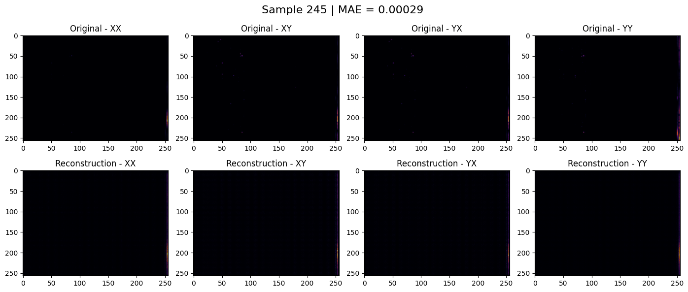
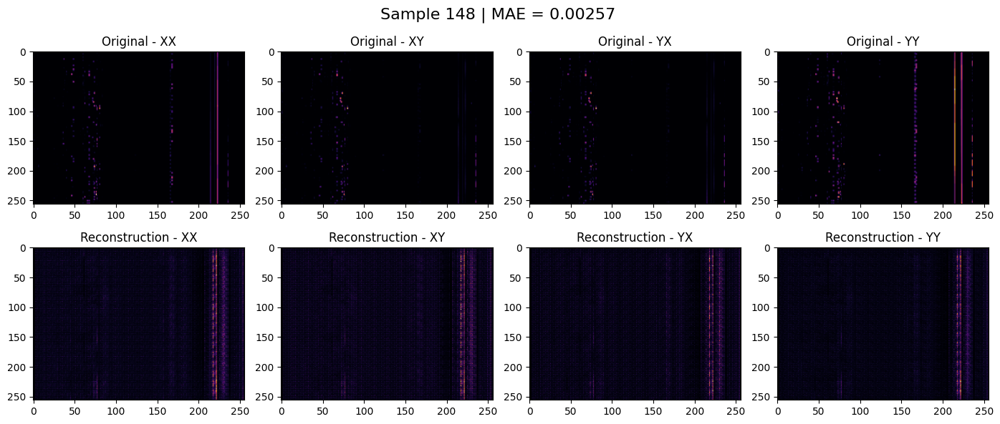
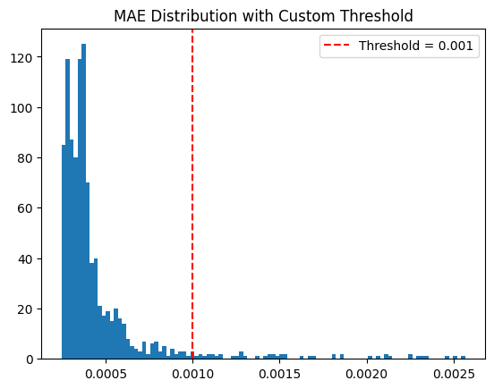
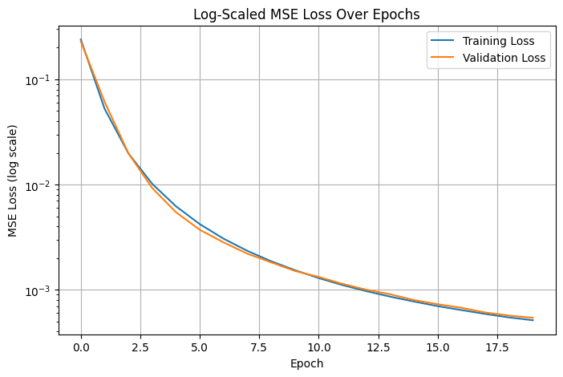

# Radio Observatory Anomaly Detection (ROAD) Project Report

## Overview
This project implements a custom convolutional autoencoder from scratch to detect anomalies in radio astronomy spectrograms from the LOFAR telescope, using the ROAD dataset. The goal is to learn a compact representation of normal space observations in order to identify non-normal or anomalous observations by high reconstruction error.

Anomaly detection in this context is particularly valuable for monitoring large-scale astronomical systems or equipment malfunctions in real time. The ability to distinguish rare or corrupted events from normal background data—without needing labeled examples—demonstrates how machine learning can reduce human workload and enhance observatory reliability.

## Dataset: ROAD (Radio Observatory Anomaly Detection)
As described in Mesarcik et al. (2023), all data were initially of varying dimensions and length. The dataset was rescaled and preprocessed into a uniform (256, 256) shape to support real-time anomaly detection in the LOFAR pipeline.
- **Source**: LOFAR telescope spectrograms gathered from 52 stations across Europe
- **Input shape**: `(256, 256, 4)` — frequency x time x polarization
  - Polarization Channels: `XX`, `XY`, `YX`, `YY`
- **Train/Test**: `train_data` and `test_data` contain only unlabeled samples
- **Anomaly Types** (in `anomaly_data`):
  - `first_order_data_loss`
  - `oscillating_tile`
  - `first_order_high_noise`
  - `lightning`
  - `solar_storm`
  - `rfi_ionosphere_reflect`
  - `third_order_data_loss`
  - `source_in_sidelobes`
  - `galactic_plane`

## Data Preprocessing
- Applied `np.log1p()` transformation transformation to compress dynamic range and reduce the influence of high-intensity outliers commonly found in radio frequency spectrograms
- Normalized all values to `[0, 1]`
- Augmented data with **random cropping** (75%–100%) + **resizing to 256x256** to encourage spatial invariance and prevent overfitting

## Model Architecture
We designed a deep convolutional autoencoder:

- **Encoder**:
  - `Conv2D → BatchNorm → LeakyReLU` stack
  - Strided downsampling to bottleneck of `(16, 16, 512)`
- **Decoder**:
  - `Conv2DTranspose → BatchNorm → LeakyReLU`
  - Upsampling back to full input size
- **Final Layer**: `Conv2DTranspose(4)` with `sigmoid` activation

Optimizer: `Adam(learning_rate=0.0005)`  
Loss Function: **Mean Absolute Error (MAE)**  
Epochs: `20`  
Batch Size: `32`

## Evaluation Metrics
We used two core metrics to evaluate reconstruction fidelity:

- **MAE (Mean Absolute Error)**
  - Measures the average absolute difference between each pixel in the original and reconstructed image:

    \[ 	ext{MAE} = rac{1}{n} \sum_{i=1}^{n} | y_i - \hat{y}_i | \]

  - MAE is robust to noise and helps the model generalize better to subtle anomalies

- **SSIM (Structural Similarity Index)**
  - A perceptual metric that compares local luminance, contrast, and structure between two images
  - More closely matches how humans perceive image similarity (closer to 1.0 is better)

- **Anomaly threshold**: threshold selection based on histogram visualization of the reconstruction error (MSE) distribution

## Results
- **Average SSIM on test set**: `0.9946` 
- Visually, low-MAE samples show near-perfect reconstruction
- High-MAE samples exhibit structural failure or blurring

| Metric | Value |
|--------|-------|
| MAE (final epoch) | ~2.4e-5 |
| SSIM (avg.) | 0.9946 |
| # Anomalies flagged (MAE threshold > 0.001) | 48 / 1000 |

These results demonstrate the model's ability to faithfully reconstruct known patterns while surfacing unexpected deviations—an essential trait for unsupervised anomaly detection in real-time data systems.

## Observations
- MAE (L1 loss) provided a more stable and interpretable reconstruction signal compared to MSE (L2 loss). Unlike L2 loss, which heavily penalizes larger errors and can be sensitive to small pixel-wise deviations, L1 loss distributes penalty more evenly across the input space. This made the model more tolerant to noise and better at learning consistent reconstructions across the entire image without overemphasizing outliers.
- Augmentation and MAE greatly improved learning stability
- Clear visual difference between top-10 and bottom-10 reconstruction samples, given by the SSIM score

## Visual Results

### Normal Reconstructions (Low MAE)

### Anomalous Reconstructions (High MAE)

### MSE Histogram

### Training Loss Over Epochs

## Limitations
- No patch-based contrastive loss (`Lcon`) used (as in ROAD paper)
- Did not classify specific anomaly types
- Could further explore PSNR, SSIM maps, or latent clustering

## Reference
Much of our approach was inspired by the methods introduced in the original ROAD paper:

> Mesarcik et al., "Self-Supervised Anomaly Detection for Radio Telescope Data with the ROAD Dataset". arXiv:2307.01054, 2023. https://arxiv.org/abs/2307.01054

This paper introduced the ROAD dataset and proposed a contrastive + reconstruction hybrid SSL loss. While our implementation focuses solely on the reconstruction component (L1 loss), we were inspired by their use of augmentation, perceptual evaluation, and anomaly framing.

## Conclusion
We implemented a successful anomaly detector using a deep autoencoder trained on normal LOFAR spectrograms. SSIM results and qualitative inspection show strong reconstruction of normal patterns and degradation on unseen anomalies — demonstrating the model's ability to generalize and detect out-of-distribution signals.

---

*Author: Shunxing "Oni" Zhang*  
*April 2025*

